# 🏥 Medical Triage Expert System

This document provides a comprehensive overview of the Medical Triage Expert System, a sophisticated tool designed to assist in the preliminary triage of patients based on their symptoms. The system leverages a rule-based expert system to provide recommendations and find nearby medical facilities.

## 1. Overview and Purpose

The Medical Triage Expert System is a web-based application that allows users to input their symptoms and receive a preliminary triage assessment. The system classifies the urgency of the situation into three levels (RED, YELLOW, GREEN), suggests a mode of transport, and provides a rationale for its recommendation. It also integrates with a location service to find nearby hospitals.

The primary purpose of this system is to:
- Provide rapid, preliminary triage advice to individuals.
- Help users understand the potential severity of their symptoms.
- Facilitate quick access to information about nearby medical facilities.
- Demonstrate the application of a CLIPS-based expert system in a real-world scenario.

**Disclaimer:** This tool is for informational purposes only and is not a substitute for professional medical advice, diagnosis, or treatment.

## 2. System Architecture

The system is built on a modular architecture that separates the user interface, the application logic, the expert system core, and data storage.

### Architecture Diagram

The following diagram illustrates the flow of information and control within the system:

```mermaid
graph TD
    subgraph User Interface
        A[User's Browser] -- Enters Symptoms & Location --> B{Frontend (simple.html)};
    end

    subgraph Backend Server (Flask)
        B -- HTTP API Call --> C{app.py};
        C -- Asserts Facts & Runs --> D[CLIPS Inference Engine];
        C -- Queries for Hospitals --> E[Location Service (location_service.py)];
        E -- Fetches Live Data --> F[External API (OpenStreetMap)];
        C -- Reads/Writes Data --> G[Database (data.db via db.py)];
    end

    subgraph Expert System Core
        D -- Loads Rules & Templates --> H{Knowledge Base (rules.clp, templates.clp)};
    end

    subgraph Data Layer
        G;
    end

    C -- Returns JSON Response --> B;
    B -- Displays Triage & Hospitals --> A;

```

### Components

-   **Frontend (`simple.html`)**: A single-page web interface where the user inputs their symptoms, age, and location. It communicates with the backend via AJAX requests.
-   **Backend (`app.py`)**: A Flask application that serves the frontend, handles API requests, and orchestrates the interaction between the other components.
-   **CLIPS Inference Engine (`clipspy`)**: The core of the expert system. It uses the rules defined in the knowledge base to reason about the patient's data.
-   **Knowledge Base (`knowledge_base/`)**: Contains the `rules.clp` and `templates.clp` files, which define the logic and data structures for the expert system.
-   **Location Service (`location_service.py`)**: A module responsible for finding nearby hospitals using the OpenStreetMap API.
-   **Database (`db.py`, `data.db`)**: A SQLite database used to store symptoms, diseases, rules, and hospital information.

## 3. Features

-   **Rule-Based Triage**: Employs a sophisticated set of over 100 rules to analyze patient symptoms.
-   **Age-Stratified Logic**: The rules are categorized by age group (from pediatrics to geriatrics) for more accurate assessments.
-   **Dynamic Hospital Search**: Fetches real-time hospital and clinic data from OpenStreetMap, making it functional in any location.
-   **Clear Recommendations**: Provides a triage level (RED, YELLOW, GREEN), a recommended mode of transport, and a clear rationale.
-   **RESTful API**: Exposes endpoints for triage, hospital search, and administrative functions.

## 4. Screenshots

Here is a series of screenshots showcasing the user interface of the expert system.

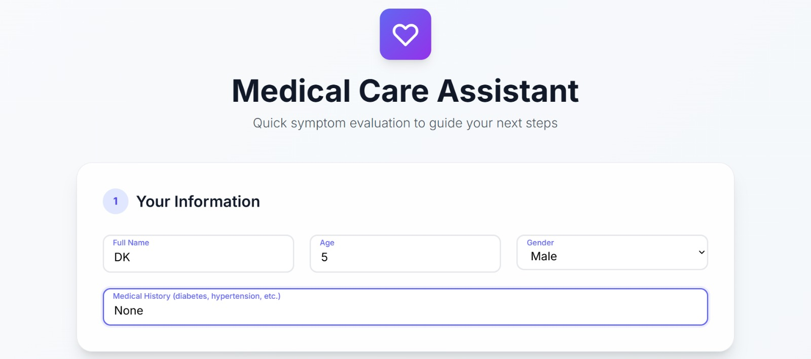


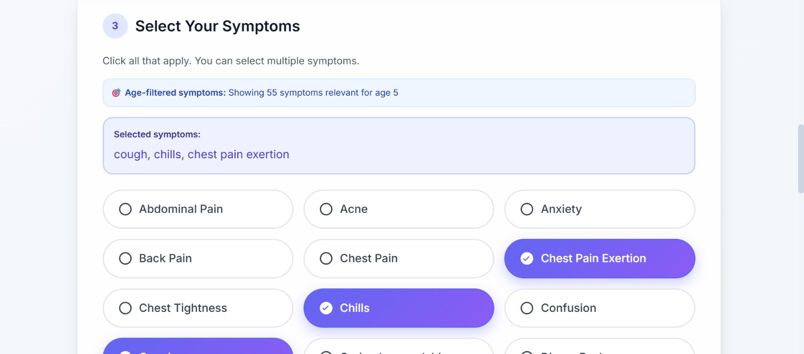
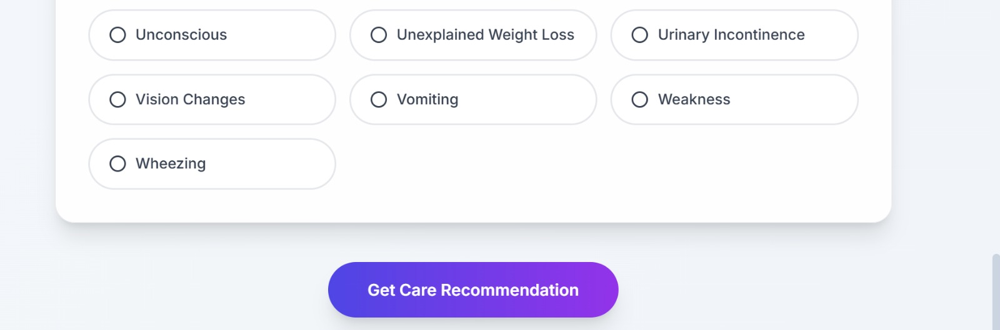
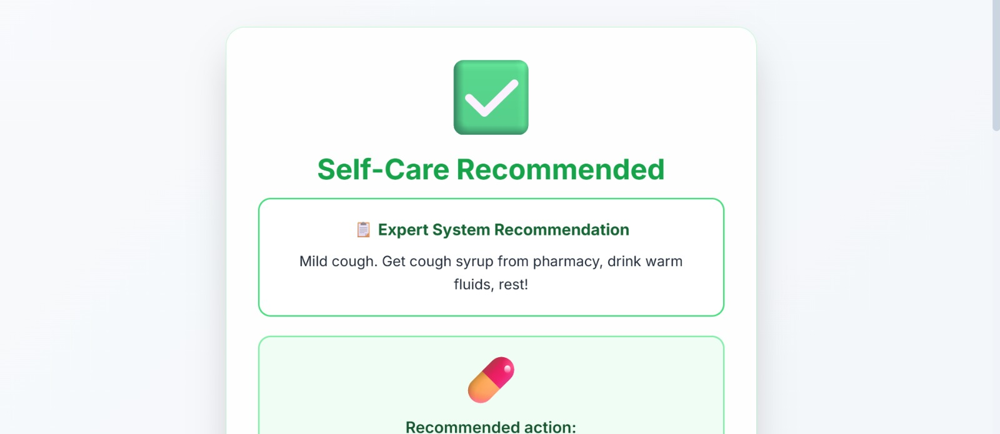
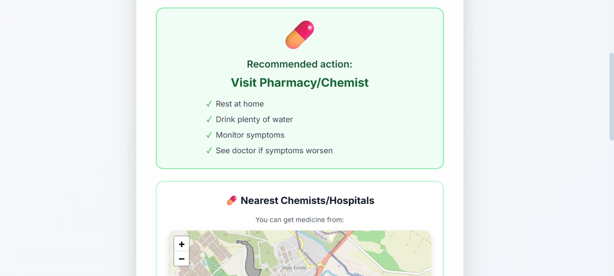
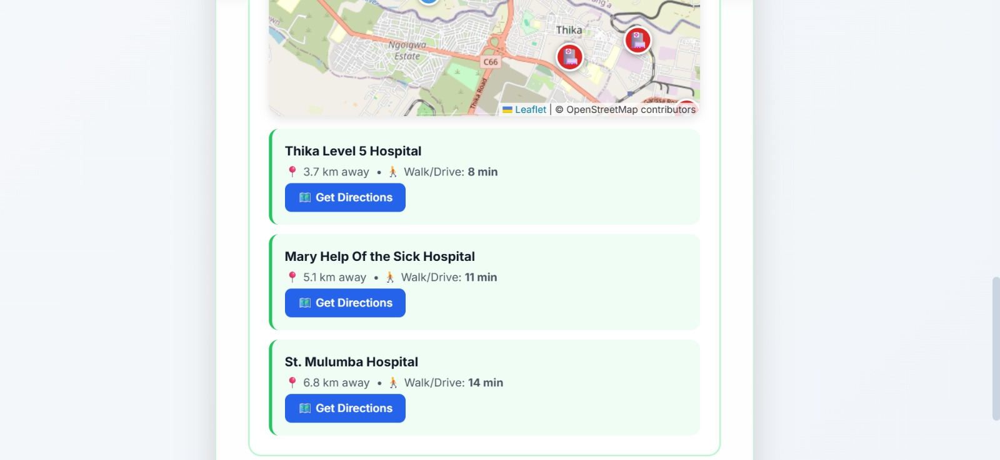

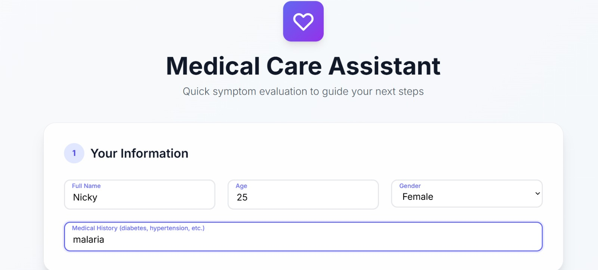

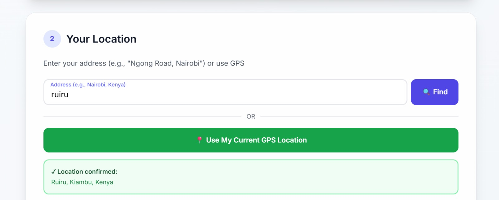


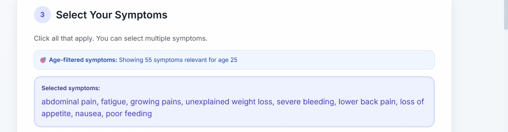
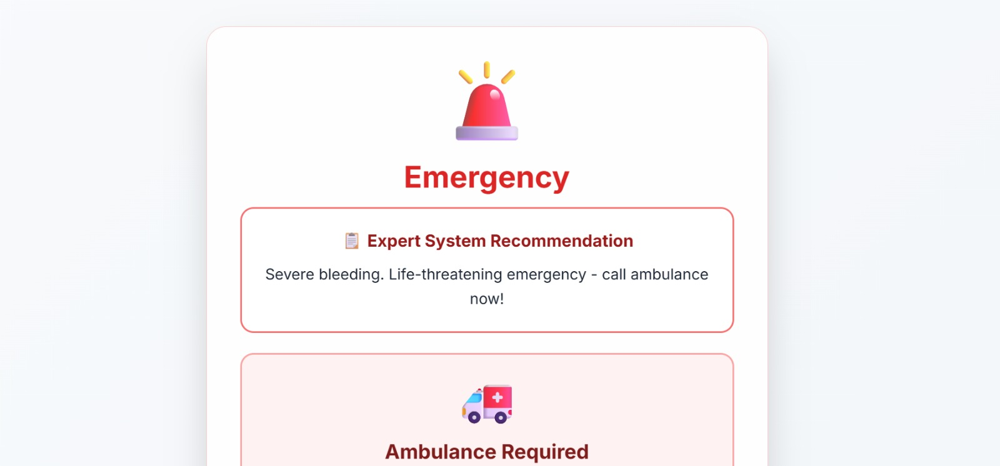
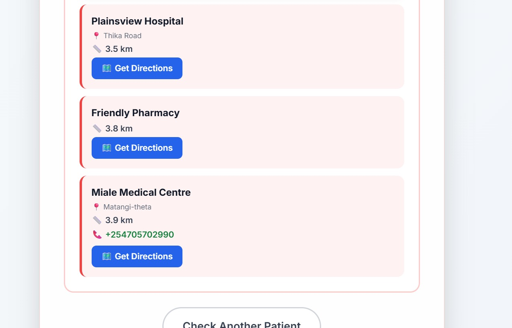


## 4.1. Rule Screenshots

To illustrate the structure and content of some of the CLIPS rules, here are screenshots of selected rules from the knowledge base:


## 5. Technology Stack

| Component         | Technology/Library      |
| ----------------- | ----------------------- |
| Backend Framework | Flask                   |
| Expert System     | `clipspy`               |
| Database          | SQLite                  |
| API Communication | REST (JSON)             |
| Frontend          | HTML, CSS, JavaScript   |
| CORS Handling     | `flask-cors`            |
| Geocoding         | OpenStreetMap (Nominatim) |

## 6. Knowledge Base

The brain of the expert system resides in the `knowledge_base` directory. It consists of two main file types:

### Templates (`templates.clp`)
This file defines the data structures (similar to structs or classes) that the expert system uses. Key templates include:
-   `patient-demographics`: Stores age and gender.
-   `patient-history`: Stores medical history.
-   `patient-symptom`: Represents a single symptom.
-   `triage-result`: Holds the output of the reasoning process.

### Rules (`rules.clp`)
This file contains the production rules that the CLIPS engine uses to make decisions. The rules are structured using a `(defrule ...)` syntax.

**Structure of a Rule:**

```clisp
(defrule <rule-name>
  "A descriptive comment about the rule's purpose."
  (declare (salience <priority>))

  ; LHS (Left-Hand Side): Conditions to match in the working memory
  (patient-demographics (age ?a&:(< ?a 10)))
  (patient-symptom (name fever))

  => ; Arrow separating conditions from actions

  ; RHS (Right-Hand Side): Actions to take when conditions are met
  (assert (triage-result (level YELLOW) (rationale "...")))
)
```

-   **Salience**: Determines the priority of the rule. Higher salience means the rule is considered first.
-   **LHS**: The "IF" part of the rule. It consists of patterns that are matched against the facts in the working memory.
-   **RHS**: The "THEN" part of the rule. It contains actions to perform, such as asserting a new fact (e.g., a `triage-result`).

The rules are organized by age group and clinical severity, from critical emergencies (salience 100) down to minor issues (salience < 40).

## 7. Setup and Installation

Follow these steps to set up and run the project locally.

### Prerequisites
- Python 3.x
- `pip` (Python package installer)

### Installation Steps

1.  **Clone the Repository (if you haven't already):**
    ```bash
    git clone <repository-url>
    cd Expertsystem-medical-symptom-traige
    ```

2.  **Create and Activate a Virtual Environment:**
    -   **Windows:**
        ```bash
        python -m venv venv
        .\venv\Scripts\activate
        ```
    -   **macOS/Linux:**
        ```bash
        python3 -m venv venv
        source venv/bin/activate
        ```

3.  **Install Dependencies:**
    ```bash
    pip install -r requirements.txt
    ```

4.  **Initialize the Database:**
    The database is initialized automatically when the application starts. You can also run the seeding scripts to populate it with initial data:
    ```bash
    python seed_symptoms_rules.py
    python seed_hospitals.py
    ```

## 8. Usage

### Running the Application

-   **Using the Start Script (Recommended on macOS/Linux):**
    ```bash
    bash start_server.sh
    ```
-   **Running Manually:**
    ```bash
    python app.py
    ```

The application will be available at `http://127.0.0.1:5000`.

### Accessing the Frontend

Open your web browser and navigate to:
[http://127.0.0.1:5000/static/simple.html](http://127.0.0.1:5000/static/simple.html)

### API Endpoints

The system exposes a set of RESTful API endpoints for programmatic access.

-   `POST /triage`: Submits patient data and returns a triage assessment.
    -   **Body**: `{ "age": 30, "symptoms": "headache, fever", "history": "none" }`
-   `POST /api/nearest-hospitals`: Finds hospitals near a given location.
    -   **Body**: `{ "latitude": -1.286389, "longitude": 36.817223, "limit": 5 }`
-   `GET /api/symptoms`: Lists all available symptoms.
-   `GET /api/rules`: Lists all triage rules from the database.

## 9. Relation to Core Expert System Concepts

Based on the provided class notes, this project serves as a practical, real-world implementation of a classic expert system. Here’s how its components directly map to the fundamental concepts:

| Expert System Concept | Project Implementation |
| :--- | :--- |
| **Knowledge Base** | The `knowledge_base/rules.clp` file is a classic example of a knowledge base. It stores the domain expertise (medical triage logic) as a set of **Production Rules (IF-THEN statements)**. This declarative knowledge is completely separate from the application's control flow. |
| **Inference Engine** | The `clipspy` library integrated into `app.py` provides the inference engine. It is responsible for applying the reasoning mechanism to the facts and rules. Specifically, it performs **forward-chaining**: starting with the initial facts (symptoms) and applying rules to deduce a conclusion (the triage result). |
| **Working Memory (Blackboard)**| For each triage request, `app.py` creates a temporary, isolated CLIPS environment. The patient's data (age, symptoms, history) are asserted into this environment as facts. This session-specific collection of facts serves as the **Working Memory** or **Blackboard**, holding the state for a single reasoning process. |
| **User Interface** | The `static/simple.html` file provides a straightforward user interface for communicating with the expert system, allowing a non-expert to input data and receive a recommendation. |
| **Explanation Subsystem** | The system provides a basic but effective explanation facility. The `rationale` that is returned with every triage result explains *why* a particular decision was made (e.g., "Chest pain at your age. HIGH CARDIAC RISK - call ambulance immediately!"). This is a key characteristic of expert systems. |
| **Knowledge Acquisition Subsystem** | While the project does not have a graphical interface for knowledge acquisition, the API endpoints in `app.py` (`/api/rules`, `/api/publish-rules`) provide a programmatic way to add, modify, and manage the rules in the knowledge base, serving a similar function. |

This project is a **Diagnosis-type** expert system application, as it infers a potential situation (the triage level) from a given set of data (symptoms).
